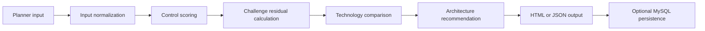

# Architecture

The platform converts the survey paper into a practical WHAS design-readiness workflow.

## Layers

1. Web interface

   `public/index.php` provides dashboard, planner, technology comparison, paper alignment, health, and JSON routes.

2. Service layer

   `src/Service/DesignService.php` calculates readiness, ranks challenge residuals, scores candidate technologies, and proposes a high-level architecture.

3. Repository layer

   `src/Repository/LabRepository.php` exposes catalog data and persists assessments when MySQL is configured.

4. Research catalog

   `config/paper.php` contains paper metadata, ZigBee features, competing technologies, application families, challenges, and controls.

5. Persistence

   The MySQL schema stores paper records, technology records, application records, challenge records, controls, mappings, design assessments, and audit events.

## Flow

## Design Logic

The service considers:

- Primary WHAS application.
- Home size and node count.
- Topology choice.
- Battery priority.
- Interference density.
- Remote monitoring and gateway need.
- Security criticality.
- Retrofit complexity.
- Selected readiness controls.

The output provides a readiness score, residual risk tier, technology ranking, recommended topology, coordinator/router/end-device counts, and next actions.

